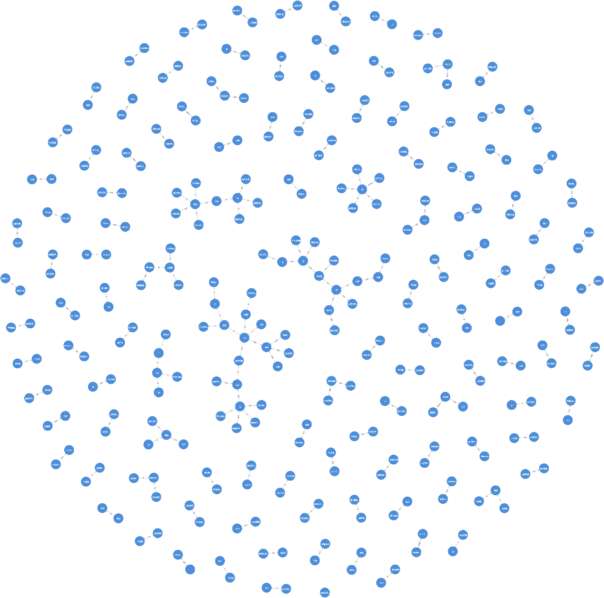

# Metaverse Knowledge Graph Construction Using Web Scraping and Neo4j

This project aims to build a knowledge graph focused on the metaverse by using web scraping, natural language processing (NLP), and graph databases. The main goal is to extract and visualize the relationships between entities in the metaverse field, making it easier for researchers and industry professionals to analyze these connections.

Memebers: Qing (Serena) Xue, Li Jiang, Xingyi Du, Minqi Zhou

## Project Overview

- **Domain**: Metaverse
- **Core Technologies**: Python, Selenium, BeautifulSoup, PyLTP, Neo4j
- **Objective**: To create a knowledge graph that represents relationships within the metaverse by extracting structured information from web articles.

## Project Environment

- **Programming Language**: Python 3.7
- **Virtual Environment**: Anaconda
- **Integrated Development Environment (IDE)**: PyCharm
- **Graph Database**: Neo4j
- **Libraries**: Selenium, Requests, BeautifulSoup, PyLTP, py2neo, Pandas

## Core Knowledge Points

1. **Web Scraping**: Used Selenium to access web pages with JavaScript-rendered content and BeautifulSoup to parse the HTML for extracting relevant data.
2. **Natural Language Processing (NLP)**: Applied PyLTP to extract subject-predicate-object triples using dependency parsing techniques.
3. **Knowledge Graph Construction**: Used Neo4j to create nodes and relationships from the extracted triples, allowing for effective visualization and analysis of the data.

## Steps

### 1. Data Collection
- **Web Scraping**: Gathered over 170 articles from the "Metaverse Observation" section of The Paper using Selenium to mimic browser interactions and BeautifulSoup to parse the HTML content.
- **Tools**: Selenium, Requests, BeautifulSoup

### 2. Triple Extraction
- **Dependency Parsing**: Used PyLTP, a Chinese NLP toolkit, to extract subject-predicate-object triples from the scraped articles, helping to structure the relationships between entities.
- **Output**: Extracted more than 18,000 triples that represent relationships within the metaverse domain.
- **Tools**: PyLTP, Python

### 3. Knowledge Graph Construction
- **Graph Database**: Created nodes and relationships from the extracted triples using Neo4j to form a knowledge graph.
- **Data Integration**: Imported the triples into Neo4j and generated a visual representation of the knowledge graph for better insights.
- **Tools**: Neo4j, py2neo, Pandas

## Results

The final knowledge graph shows the relationships between various entities like companies, technologies, and key figures in the metaverse space. This visualization provides valuable insights and helps to identify patterns within the evolving metaverse landscape.

## Future Work

- **Data Quality Improvement**: Improve the accuracy of relationships by enhancing named entity recognition and semantic role labeling.
- **Coreference Resolution**: Add coreference resolution to better manage pronouns and ambiguous references within the text.
